---
# Front matter
lang: ru-RU
title: "Лабораторная работа #1."
subtitle: "Установка и конфигурация операционной системы на виртуальную машину"
author: "Барсегян Вардан НПИбд-01-22"

# Formatting
toc-title: "Содержание"
toc: true # Table of contents
toc_depth: 2
lof: true # List of figures
fontsize: 12pt
linestretch: 1.5
papersize: a4paper
documentclass: scrreprt
polyglossia-lang: russian
polyglossia-otherlangs: english
mainfont: Times New Roman
romanfont: Times New Roman
sansfont: Times New Roman
monofont: Times New Roman
mainfontoptions: Ligatures=TeX
romanfontoptions: Ligatures=TeX
sansfontoptions: Ligatures=TeX,Scale=MatchLowercase
monofontoptions: Scale=MatchLowercase
indent: true
pdf-engine: lualatex
header-includes:
  - \linepenalty=10 # the penalty added to the badness of each line within a paragraph (no associated penalty node) Increasing the value makes tex try to have fewer lines in the paragraph.
  - \interlinepenalty=0 # value of the penalty (node) added after each line of a paragraph.
  - \hyphenpenalty=50 # the penalty for line breaking at an automatically inserted hyphen
  - \exhyphenpenalty=50 # the penalty for line breaking at an explicit hyphen
  - \binoppenalty=700 # the penalty for breaking a line at a binary operator
  - \relpenalty=500 # the penalty for breaking a line at a relation
  - \clubpenalty=150 # extra penalty for breaking after first line of a paragraph
  - \widowpenalty=150 # extra penalty for breaking before last line of a paragraph
  - \displaywidowpenalty=50 # extra penalty for breaking before last line before a display math
  - \brokenpenalty=100 # extra penalty for page breaking after a hyphenated line
  - \predisplaypenalty=10000 # penalty for breaking before a display
  - \postdisplaypenalty=0 # penalty for breaking after a display
  - \floatingpenalty = 20000 # penalty for splitting an insertion (can only be split footnote in standard LaTeX)
  - \raggedbottom # or \flushbottom
  - \usepackage{float} # keep figures where there are in the text
  - \floatplacement{figure}{H} # keep figures where there are in the text
---

# Цель работы

 - Целью данной работы является приобретение практических навыков установки операционной системы на виртуальную машину, настройки минимально необходимых для дальнейшей работы сервисов

# Выполнение лабораторной работы

 - Выбираю в VirtualBox нужный дистрибутив, ввожу имя Rocky-vlbarsegyan
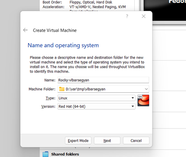{ #fig:001 width=70% }

 - Выбираю размер памяти
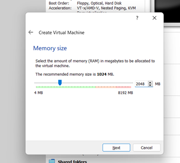{ #fig:002 width=70% }

 - Создаю новый диск

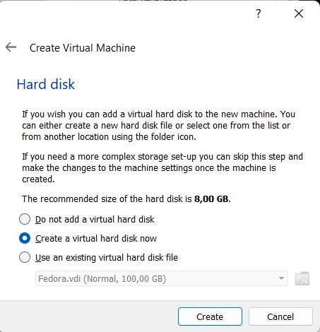{ #fig:003 width=70% }

- Выбираю тип файла для жесткого диск
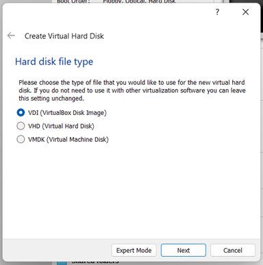{ #fig:004 width=70% }

- Выбираю размер файла и его расположение
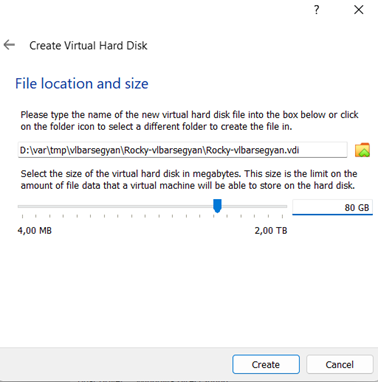{ #fig:005 width=70% }

- Выбираю скачанный образ Rocky-9.2
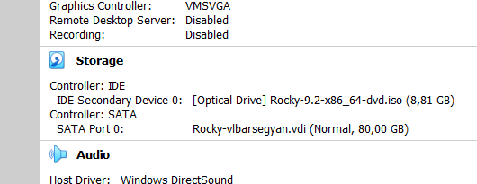{ #fig:006 width=70% }

- Запускаю виртуальную машину
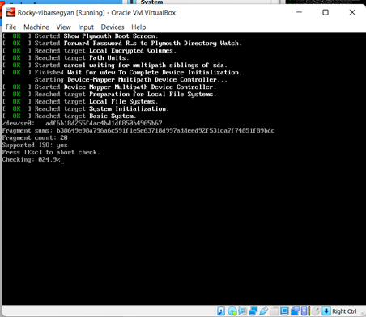{ #fig:007 width=70% }

- Выбор языка
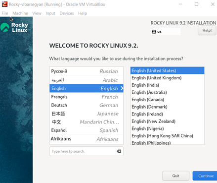{ #fig:008 width=70% }

- Дополнительно выбираю инструменты разработчика для установки
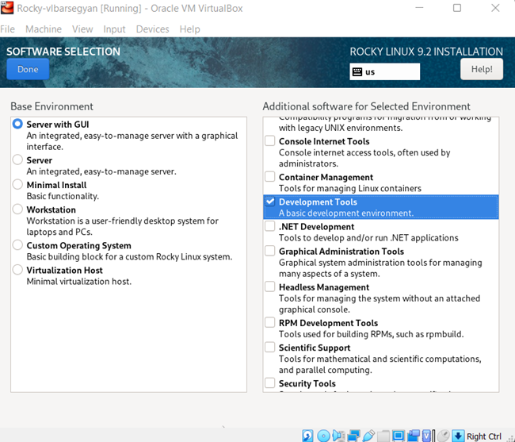{ #fig:009 width=70% }

- Выбираю жесткий диск
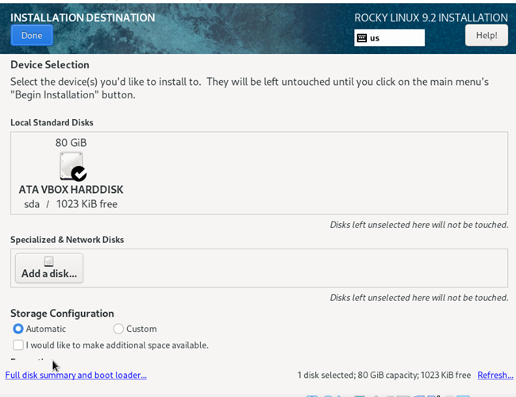{ #fig:010 width=70% }

- Указываю hostname
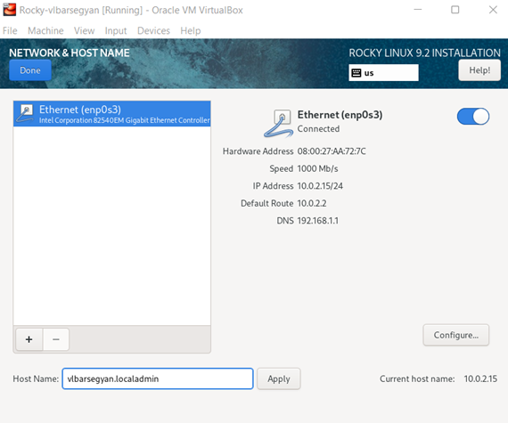{ #fig:011 width=70% }

- Указываю пароль root
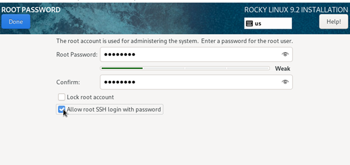{ #fig:012 width=70% }

- Создаю нового пользователя и указываю пароль
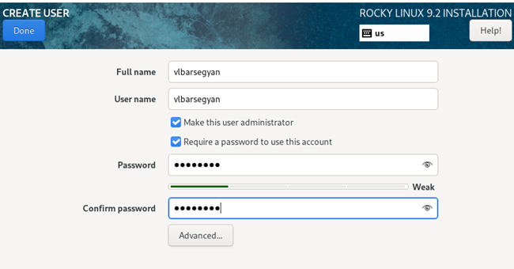{ #fig:013 width=70% }

- После запуска ВМ, устанавливаю образ диска дополнений гостевой ОС и запускаю его
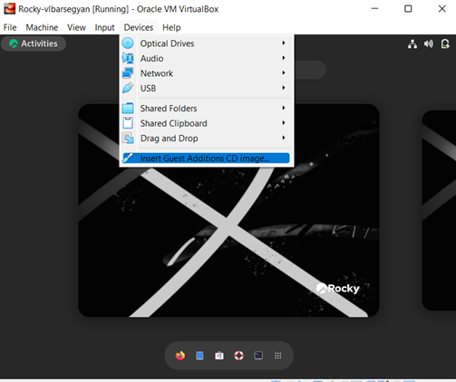{ #fig:0014 width=70% }

# Вывод 
  - Я создал виртуальную машину на дистрибутиве Rocky, настроил необходимые функции, вспомнил некоторые команды в Linux

