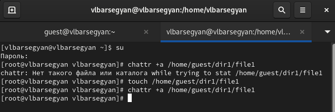

---
## Front matter
lang: ru-RU
title: Лабораторная Работа №4. Дискреционное разграничение прав в Linux. Расширенные атрибуты
subtitle: Операционные системы
author:
  - Барсегян В.Л.
institute:
  - Российский университет дружбы народов им. Патриса Лумумбы, Москва, Россия

## i18n babel
babel-lang: russian
babel-otherlangs: english

## Formatting pdf
toc: false
toc-title: Содержание
slide_level: 2
aspectratio: 169
section-titles: true
theme: metropolis
header-includes:
 - \metroset{progressbar=frametitle,sectionpage=progressbar,numbering=fraction}
 - '\makeatletter'
 - '\beamer@ignorenonframefalse'
 - '\makeatother'

## Fonts
mainfont: Arial
romanfont: Arial
sansfont: Arial
monofont: Arial
---

## Докладчик

  * Барсегян Вардан Левонович
  * НПИбд-01-22
  * Российский университет дружбы народов
  * [1132222005@pfur.ru]
  * <https://github.com/VARdamn/oib>
  
# Вводная часть

## Цели и задачи

Получение практических навыков работы в консоли с расширенными атрибутами файлов.

# Выполнение лабораторной работы

## От пользователя guest определяю расширенные атрибуты файла /home/guest/dir1/file1 командой */lsattr /home/guest/dir1/file1*. Далее, устанавливаю командой *chmod 600 file1* на файл file1 права, разрешающие чтение и запись для владельца файла. Пробую установить расширенный атрибут a от имени пользователя guest командой *chattr +a /home/guest/dir1/file1* 

{ #fig:001 width=60% }

## Пробую установить расширенный атрибут a от имени суперпользователя  командой *chattr +a /home/guest/dir1/file1*

{ #fig:002 width=60% }

## Проверяю правильность установления атрибута командой *lsattr /home/guest/dir1/file1*

{ #fig:003 width=60% }

## Выполняю дозапись в файл file1 слова «test» командой *echo "test" /home/guest/dir1/file1*. После этого, выполняю чтение файла file1 командой *cat /home/guest/dir1/file1* - слово не записалось

{ #fig:004 width=60% }

## Пробую удалить файл file1 либо стереть имеющуюся в нём информацию командой *echo "abcd" > /home/guest/dirl/file1*. Далее, пробую переименовать файл командой *mv*, операция не позволена 

{ #fig:005 width=60% }

## С помощью команды *chmod 000 file1* установить на файл file1 права - операция не позволена 

{ #fig:006 width=60% }

## Снимаю расширенный атрибут a с файла /home/guest/dirl/file1 от имени суперпользователя командой *chattr -a /home/guest/dir1/file1* и снова пробую изменить права доступа - теперь успешно

{ #fig:007 width=60% }

## Заменяю расширенный атрибут a на атрибут i командой *chattr +i /home/guest/dir1/file1*. При попытке дозаписать текст или удалить  файл вновь выходит ошибка 

{ #fig:008 width=60% }

## Также пробую переименовать файл или изменить права доступа, также безуспешно

{ #fig:009 width=60% }

## Вывод

В результате выполнения работы я повысил свои навыки использования интерфейса командой строки (CLI), познакомился на примерах с тем, как используются основные и расширенные атрибуты при разграничении доступа. Имел возможность связать теорию дискреционного разделения доступа (дискреционная политика безопасности) с её реализацией на практике в ОС Linux
