---
## Front matter
lang: ru-RU
title: Лабораторная Работа №5. Дискреционное разграничение прав в Linux. Исследование влияния дополнительных атрибутов
subtitle: Операционные системы
author:
  - Барсегян В.Л.
institute:
  - Российский университет дружбы народов им. Патриса Лумумбы, Москва, Россия

## i18n babel
babel-lang: russian
babel-otherlangs: english

## Formatting pdf
toc: false
toc-title: Содержание
slide_level: 2
aspectratio: 169
section-titles: true
theme: metropolis
header-includes:
 - \metroset{progressbar=frametitle,sectionpage=progressbar,numbering=fraction}
 - '\makeatletter'
 - '\beamer@ignorenonframefalse'
 - '\makeatother'

## Fonts
mainfont: Arial
romanfont: Arial
sansfont: Arial
monofont: Arial
---

## Докладчик

  * Барсегян Вардан Левонович
  * НПИбд-01-22
  * Российский университет дружбы народов
  * [1132222005@pfur.ru]
  * <https://github.com/VARdamn/study_2023-2024_infosec>
  
# Вводная часть

## Цели и задачи

Изучение механизмов изменения идентификаторов, применения SetUID- и Sticky-битов. Получение практических навыков работы в консоли с дополнительными атрибутами. Рассмотрение работы механизма смены идентификатора процессов пользователей, а также влияние бита Sticky на запись и удаление файлов.

# Выполнение лабораторной работы

## Создаю файл simpleid.c

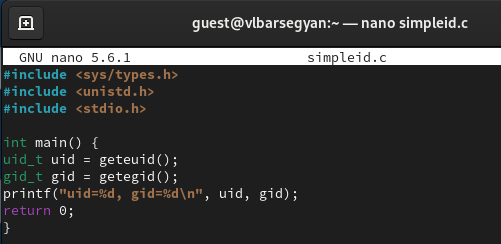{ #fig:001 width=70% }

## Компилирую программу командой *gcc simpleid.c -o simpleid* и проверяю, что файл создан 

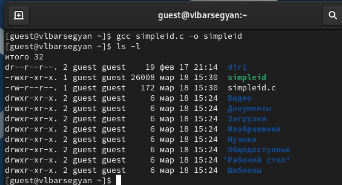{ #fig:002 width=70% }

## Выполняю программу simpleid командой *./simpleid*, а зтем системную программу *id* - вывод одинаков

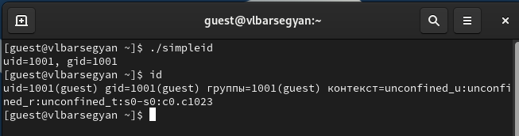{ #fig:003 width=70% }

## Усложняю программу и записываю ее в файл simpleid2.c

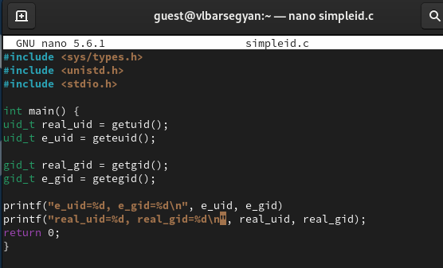{ #fig:004 width=70% }

## Компилирую и запускаю программу командами *gcc simpleid2.c -o simpleid2* и *./simpleid2*

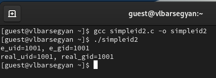{ #fig:005 width=70% }

## От суперпользователя выполняю команды *chown root:guest /home/guest/simpleid2* и *chmod u+s /home/guest/simpleid2*. Проверяю правильность новых атрибутов командой *ls -l simpleid2*. Запускаю simpleid2 и id: *./simpleid2*, *id* 

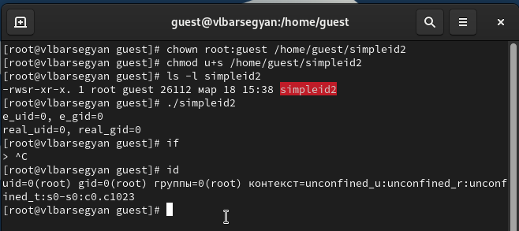{ #fig:006 width=70% }

## Делаю тоже самое относительно SetGID-бита: устанавливаю его командой *chmod g+s /home/guest/simpleid2*, проверяю установку нового автрибута и запускаю simpleid2 и id 

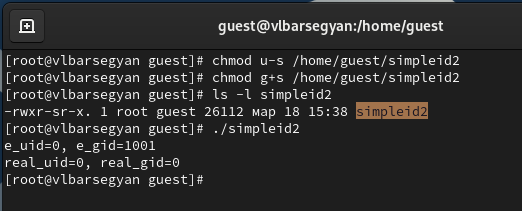{ #fig:007 width=70% }

## Создаю программу readfile.c

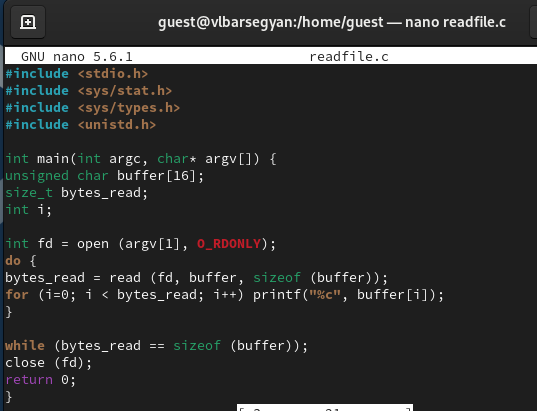{ #fig:008 width=70% }

## Компилирую ее командой *gcc readfile.c -o readfile* и изменяю права доступа так, чтобы только суперпользователь мог прочитать его, a guest не мог 

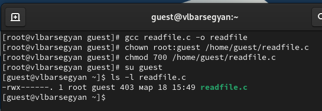{ #fig:009 width=70% }

## Командой *cat readfile.c* проверяю, что пользователь guest не может прочитать файл readfile.c. Устанавливаю SetU’D-бит и теперь от пользователя guest можно прочитать файл 

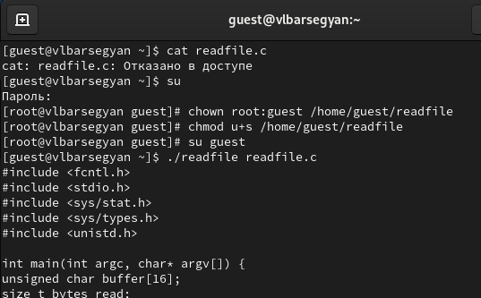{ #fig:010 width=70% }

## Проверяю, может ли программа readfile прочитать файл /etc/shadow - да, может

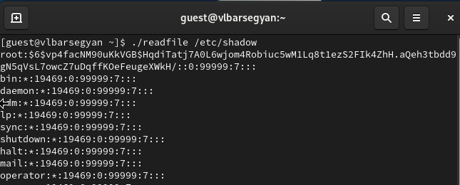{ #fig:011 width=70% }

## Исследование Sticky-бита

## Проверяю, установлен ли атрибут Sticky на директории /tmp командой *ls -l / | grep tmp*. От пользователя guest создаю файл со словом test командой *echo "test" > /tmp/file01.txt*. Просматриваю атрибуты у только что созданного файла и разрешаю чтение и запись для категории пользователей «все остальные» 

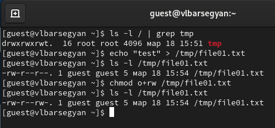{ #fig:012 width=70% }

## От пользователя guest пробую прочитать файл командой *cat /tmp/file01.txt*, далее записываю в файл слово test2 и вновь читаю его - текст файла изменен

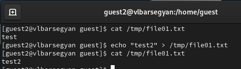{ #fig:013 width=70% }

## От пользователя guest2 пробую записать в файл /tmp/file01.txt слово test3, стерев при этом всю имеющуюся в файле информацию командой *echo "test3" > /tmp/file01.txt* - операцию выполнить удалось. Просматриваю содержимое файла и пробую удалить его - удалить не удалось

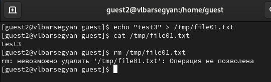{ #fig:014 width=70% }

## От суперпользователя ввожу команду, снимающую атрибут t (Sticky-бит) с директории /tmp: *chmod -t /tmp*. Проверяю от пользователя guest2, что атрибута t у директории /tmp нет командой *ls -l / | grep tmp*

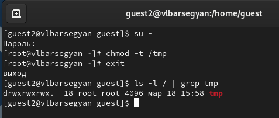{ #fig:015 width=70% }

## Снова пробую записать, прочитать и удалить файл - все операции выполнены успешно

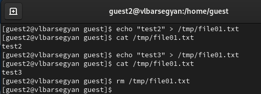{ #fig:016 width=70% }

## Возвращаюсь в суперпользователя и возвращаю атрибут t на директорию /tmp командой *chmod +t /tmp*

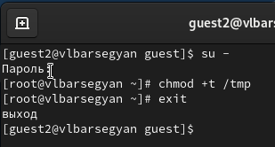{ #fig:017 width=70% }

## Вывод

Я научился применять SetUID- и Sticky-биты, поработал с дополнительными атрибутами в консоли, рассмотрел работу механизма смены идентификатора процессов пользователей и влияние бита Sticky на запись и удаление файлов.  