---
## Front matter
title: "Отчёт по лабораторной работе №5"
subtitle: "Дисциплина: Основы информационной безопасности"
author: "Барсегян Вардан Левонович НПИбд-01-22"

## Generic otions
lang: ru-RU
toc-title: "Содержание"

## Bibliography
bibliography: bib/cite.bib
csl: pandoc/csl/gost-r-7-0-5-2008-numeric.csl

## Pdf output format
toc: true # Table of contents
toc-depth: 2
lof: true # List of figures
lot: true # List of tables
fontsize: 12pt
linestretch: 1.5
papersize: a4
documentclass: scrreprt
## I18n polyglossia
polyglossia-lang:
  name: russian
polyglossia-otherlangs:
  name: english
## I18n babel
babel-lang: russian
babel-otherlangs: english
## Fonts
mainfont: Arial
romanfont: Arial
sansfont: Arial
monofont: Arial
mainfontoptions: Ligatures=TeX
romanfontoptions: Ligatures=TeX
sansfontoptions: Ligatures=TeX,Scale=MatchLowercase
monofontoptions: Scale=MatchLowercase,Scale=0.9
## Biblatex
biblatex: true
biblio-style: "gost-numeric"
biblatexoptions:
  - parentracker=true
  - backend=biber
  - hyperref=auto
  - language=auto
  - autolang=other*
  - citestyle=gost-numeric
## Pandoc-crossref LaTeX customization
figureTitle: "Рис."
tableTitle: "Таблица"
listingTitle: "Листинг"
lofTitle: "Список иллюстраций"
lotTitle: "Список таблиц"
lolTitle: "Листинги"
## Misc options
indent: true
header-includes:
  - \usepackage{indentfirst}
  - \usepackage{float} # keep figures where there are in the text
  - \floatplacement{figure}{H} # keep figures where there are in the text
---

# Цель работы

Изучение механизмов изменения идентификаторов, применения SetUID- и Sticky-битов. Получение практических навыков работы в консоли с дополнительными атрибутами. Рассмотрение работы механизма смены идентификатора процессов пользователей, а также влияние бита Sticky на запись и удаление файлов.

# Выполнение лабораторной работы

## Создание программы

1. Создаю файл simpleid.c (рис. [-@fig:001])

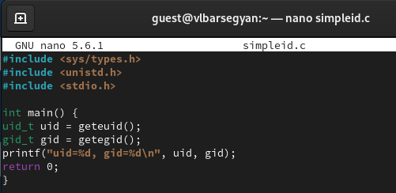{ #fig:001 width=70% }

2. Компилирую программу командой *gcc simpleid.c -o simpleid* и проверяю, что файл создан (рис. [-@fig:002])

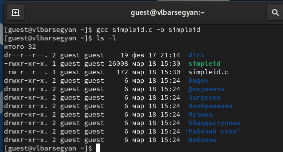{ #fig:002 width=70% }

3. Выполняю программу simpleid командой *./simpleid*, а зтем системную программу *id* - вывод одинаков (рис. [-@fig:003])

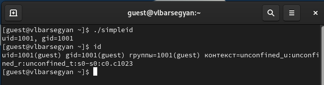{ #fig:003 width=70% }

4. Усложняю программу и записываю ее в файл simpleid2.c (рис. [-@fig:004])

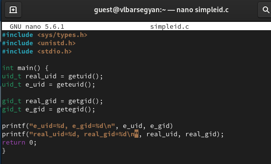{ #fig:004 width=70% }

5. Компилирую и запускаю программу командами *gcc simpleid2.c -o simpleid2* и *./simpleid2* (рис. [-@fig:005])

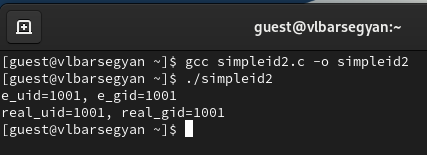{ #fig:005 width=70% }

6. От суперпользователя выполняю команды *chown root:guest /home/guest/simpleid2* и *chmod u+s /home/guest/simpleid2*. Проверяю правильность новых атрибутов командой *ls -l simpleid2*. Запускаю simpleid2 и id: *./simpleid2*, *id* (рис. [-@fig:006])

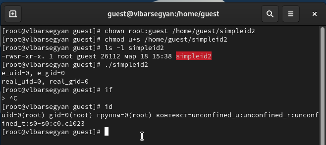{ #fig:006 width=70% }

7. Делаю тоже самое относительно SetGID-бита: устанавливаю его командой *chmod g+s /home/guest/simpleid2*, проверяю установку нового автрибута и запускаю simpleid2 и id  (рис. [-@fig:007])

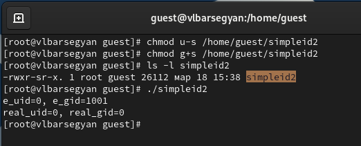{ #fig:007 width=70% }

8. Создаю программу readfile.c (рис. [-@fig:008])

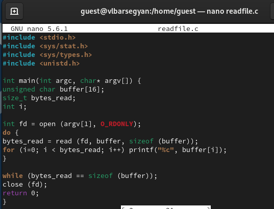{ #fig:008 width=70% }

9. Компилирую ее командой *gcc readfile.c -o readfile* и изменяю права доступа так, чтобы только суперпользователь мог прочитать его, a guest не мог (рис. [-@fig:009])

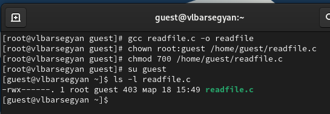{ #fig:009 width=70% }

10. Командой *cat readfile.c* проверяю, что пользователь guest не может прочитать файл readfile.c. Устанавливаю SetU’D-бит и теперь от пользователя guest можно прочитать файл (рис. [-@fig:010])

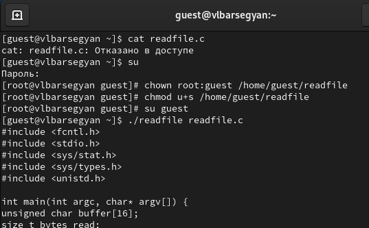{ #fig:010 width=70% }

11. Проверяю, может ли программа readfile прочитать файл /etc/shadow - да, может (рис. [-@fig:011])

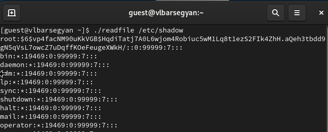{ #fig:011 width=70% }

## Исследование Sticky-бита

12. Проверяю, установлен ли атрибут Sticky на директории /tmp командой *ls -l / | grep tmp*. От пользователя guest создаю файл со словом test командой *echo "test" > /tmp/file01.txt*. Просматриваю атрибуты у только что созданного файла и разрешаю чтение и запись для категории пользователей «все остальные» (рис. [-@fig:012])

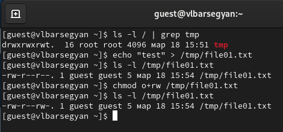{ #fig:012 width=70% }

13. От пользователя guest пробую прочитать файл командой *cat /tmp/file01.txt*, далее записываю в файл слово test2 и вновь читаю его - текст файла изменен (рис. [-@fig:013])

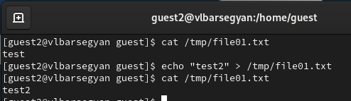{ #fig:013 width=70% }

14. От пользователя guest2 пробую записать в файл /tmp/file01.txt слово test3, стерев при этом всю имеющуюся в файле информацию командой *echo "test3" > /tmp/file01.txt* - операцию выполнить удалось. Просматриваю содержимое файла и пробую удалить его - удалить не удалось (рис. [-@fig:014])

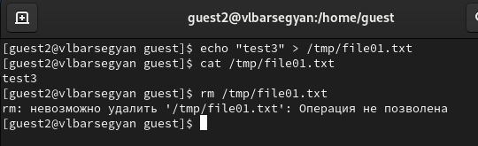{ #fig:014 width=70% }

15. От суперпользователя ввожу команду, снимающую атрибут t (Sticky-бит) с директории /tmp: *chmod -t /tmp*. Проверяю от пользователя guest2, что атрибута t у директории /tmp нет командой *ls -l / | grep tmp*  (рис. [-@fig:015])

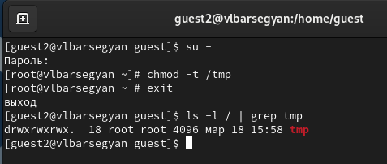{ #fig:015 width=70% }

16. Снова пробую записать, прочитать и удалить файл - все операции выполнены успешно (рис. [-@fig:016])

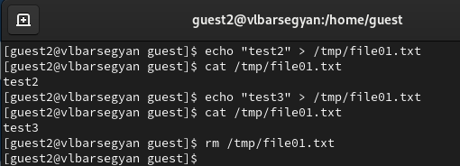{ #fig:016 width=70% }

17. Возвращаюсь в суперпользователя и возвращаю атрибут t на директорию /tmp командой *chmod +t /tmp* (рис. [-@fig:017])

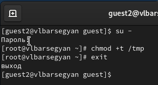{ #fig:017 width=70% }

# Выводы

Я научился применять SetUID- и Sticky-биты, поработал с дополнительными атрибутами в консоли, рассмотрел работу механизма смены идентификатора процессов пользователей и влияние бита Sticky на запись и удаление файлов.  

# Список литературы{.unnumbered}

::: {#refs}
:::
