---
## Front matter
title: "Отчёт по лабораторной работе №6"
subtitle: "Дисциплина: Основы информационной безопасности"
author: "Барсегян Вардан Левонович НПИбд-01-22"

## Generic otions
lang: ru-RU
toc-title: "Содержание"

## Bibliography
bibliography: bib/cite.bib
csl: pandoc/csl/gost-r-7-0-5-2008-numeric.csl

## Pdf output format
toc: true # Table of contents
toc-depth: 2
lof: true # List of figures
lot: true # List of tables
fontsize: 12pt
linestretch: 1.5
papersize: a4
documentclass: scrreprt
## I18n polyglossia
polyglossia-lang:
  name: russian
polyglossia-otherlangs:
  name: english
## I18n babel
babel-lang: russian
babel-otherlangs: english
## Fonts
mainfont: Arial
romanfont: Arial
sansfont: Arial
monofont: Arial
mainfontoptions: Ligatures=TeX
romanfontoptions: Ligatures=TeX
sansfontoptions: Ligatures=TeX,Scale=MatchLowercase
monofontoptions: Scale=MatchLowercase,Scale=0.9
## Biblatex
biblatex: true
biblio-style: "gost-numeric"
biblatexoptions:
  - parentracker=true
  - backend=biber
  - hyperref=auto
  - language=auto
  - autolang=other*
  - citestyle=gost-numeric
## Pandoc-crossref LaTeX customization
figureTitle: "Рис."
tableTitle: "Таблица"
listingTitle: "Листинг"
lofTitle: "Список иллюстраций"
lotTitle: "Список таблиц"
lolTitle: "Листинги"
## Misc options
indent: true
header-includes:
  - \usepackage{indentfirst}
  - \usepackage{float} # keep figures where there are in the text
  - \floatplacement{figure}{H} # keep figures where there are in the text
---

# Цель работы

Развить навыки администрирования ОС Linux. Получить первое практическое знакомство с технологией SELinux. Проверить работу SELinx на практике совместно с веб-сервером Apache.

# Выполнение лабораторной работы

1. Убеждаюсь, что SELinux работает в режиме enforcing политики targeted с помощью команд *getenforce* и *sestatus*. Запускаю веб-сервер командой *service httpd start* и проверяю его статус командой *service httpd status* (рис. [-@fig:001])

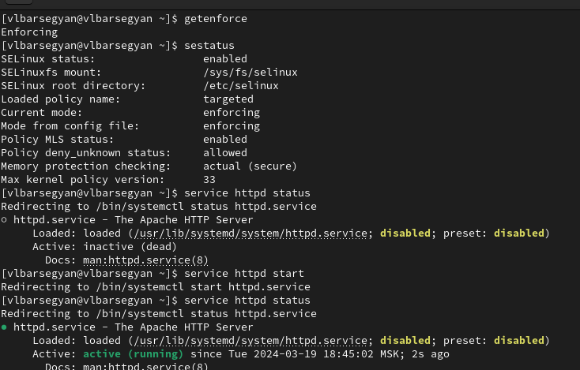{ #fig:001 width=70% }

2. Определяю контекст безопасности веб-сервера с помощью команды *ps auxZ | grep httpd* (рис. [-@fig:002])

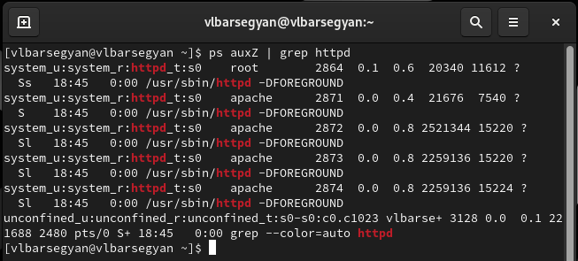{ #fig:002 width=70% }

3. Просматриваю текущее состояние переключателей SELinux для Apache с помощью команды *sestatus -b | grep httpd* (рис. [-@fig:003])

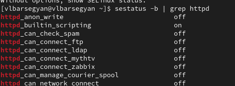{ #fig:003 width=70% }

4. Смотрю статистику по политике с помощью команды *seinfo* (рис. [-@fig:004])

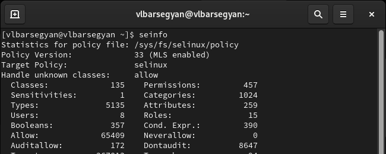{ #fig:004 width=70% }

5. Определяю тип файлов и поддиректорий, находящихся в директории /var/www, с помощью команды *ls -lZ /var/www*. Аналогично для директории /var/www/html (рис. [-@fig:005])

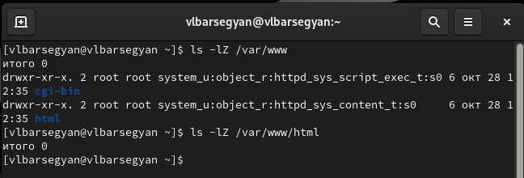{ #fig:005 width=70% }

6. Создаю файл /var/www/html/test.html и записываю следующий html-код (рис. [-@fig:006])

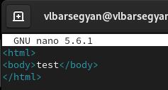{ #fig:006 width=70% }

7. Проверяю контекст созданного файла командой *ps auxZ | grep test.html* (рис. [-@fig:007])

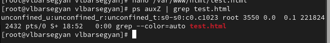{ #fig:007 width=70% }

8. Проверяю в браузере, что файл успешно отображается (рис. [-@fig:008])

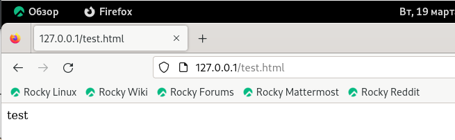{ #fig:008 width=70% }

9. Изучаю справку man по командам httpd и selinux, также проверяю контекст файла командой *ls -Z /var/www/html/test.html* (рис. [-@fig:009])

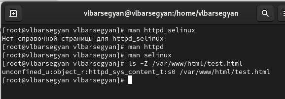{ #fig:009 width=70% }

10. Изменяю контекст файла test.html командой *chcon -t samba_share_t /var/www/html/test.html*. После, проверяю его и открываю веб-страницу - нет доступа (рис. [-@fig:010])

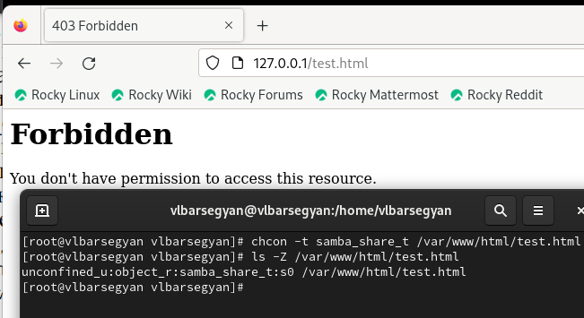{ #fig:010 width=70% }

11. Просматриваю системный лог-файл командой *tail /var/log/messages* (рис. [-@fig:011])

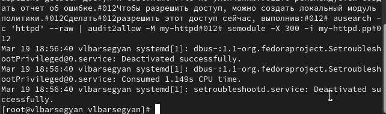{ #fig:011 width=70% }

12. В файле /etc/httpd/conf/httpd.conf меняю порт на 81 (рис. [-@fig:012])

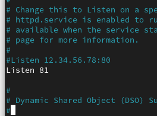{ #fig:012 width=70% }

13. Перезагружаю веб-сервер - получен сбой (рис. [-@fig:013])

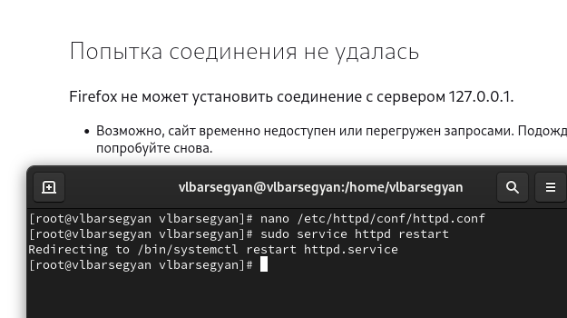{ #fig:013 width=70% }

14. Анализирую лог-файлы командами *tail -nl /var/log/messages* и *cat /var/log/http/error_log* (рис. [-@fig:014])

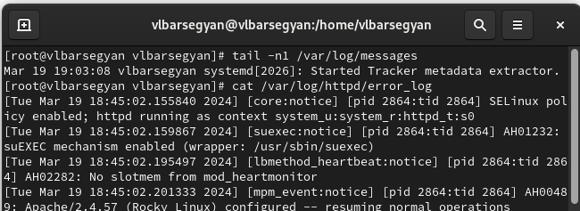{ #fig:014 width=70% }

15. Также проверяю лог-файл */var/log/http/access_log* (рис. [-@fig:015])

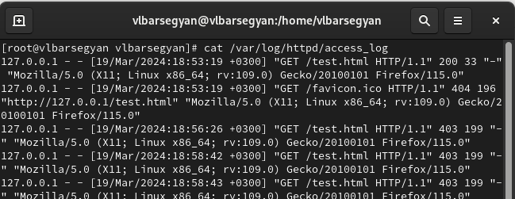{ #fig:015 width=70% }

16. Также проверяю лог-файл */var/log/audit/audit.log*. (рис. [-@fig:016])

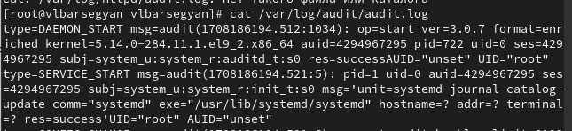{ #fig:016 width=70% }

17. Выполняю команду *semanage port -a -t http_port_t -р tcp 81* и проверяю список портов командой *semanage port -l | grep http_port_t* - порт 81 появился в списке (рис. [-@fig:017])

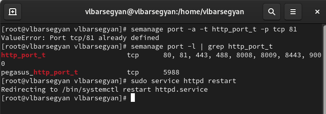{ #fig:017 width=70% }

18. Возвращаю контекст httpd_sys_cоntent__t к файлу /var/www/html/ test.html, введя *chcon -t httpd_sys_content_t /var/www/html/test.html*. Перезапускаю веб-сервер командой *sudo service httpd restart* (рис. [-@fig:018])

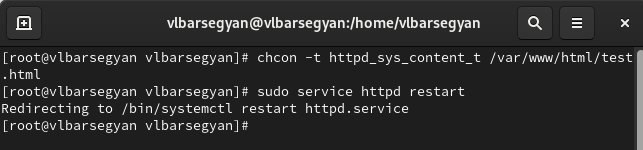{ #fig:018 width=70% }

19. Возвращаю порт 80 в конфигурационном файле (рис. [-@fig:019])

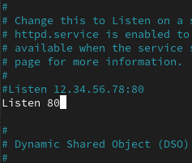{ #fig:019 width=70% }

20. Удаляю привязку http_port_t к 81 порту командой  *semanage port -d -t http_port_t -p tcp 81* и удаляю файл test.html командой *rm /var/www/html/test.html* (рис. [-@fig:020])

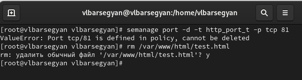{ #fig:020 width=70% }

# Выводы

Я развил навыки администрирования ОС Linux, познакомился с технологией SELinux, поработал с веб-сервером Apache

# Список литературы{.unnumbered}

::: {#refs}
:::