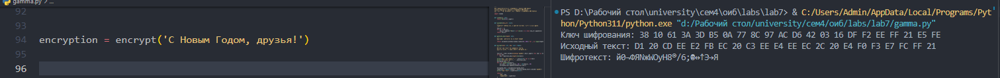
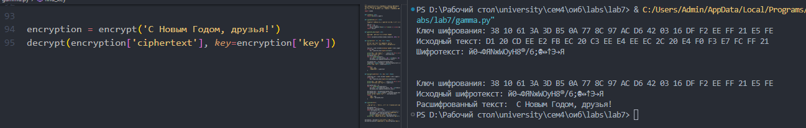
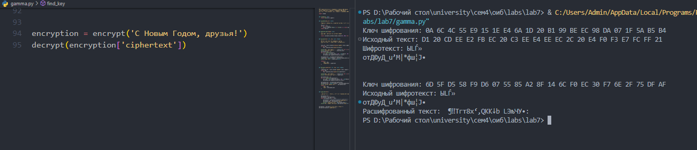

---
## Front matter
lang: ru-RU
title: Лабораторная Работа №7. Элементы криптографии. Однократное гаммирование
subtitle: Основы информационной безопасности
author:
  - Барсегян В.Л.
institute:
  - Российский университет дружбы народов им. Патриса Лумумбы, Москва, Россия

## i18n babel
babel-lang: russian
babel-otherlangs: english

## Formatting pdf
toc: false
toc-title: Содержание
slide_level: 2
aspectratio: 169
section-titles: true
theme: metropolis
header-includes:
 - \metroset{progressbar=frametitle,sectionpage=progressbar,numbering=fraction}
 - '\makeatletter'
 - '\beamer@ignorenonframefalse'
 - '\makeatother'

## Fonts
mainfont: Arial
romanfont: Arial
sansfont: Arial
monofont: Arial
---


## Докладчик


  * Барсегян Вардан Левонович
  * НПИбд-01-22
  * Российский университет дружбы народов
  * [1132222005@pfur.ru]
  * <https://github.com/VARdamn/oib>
  
# Вводная часть

## Цели и задачи

Освоить на практике применение режима однократного гаммирования.

# Выполнение лабораторной работы

## Создаю функцию encrypt(), которая будет шифровать заданный текст с помощью гаммирования. Также можно подать на вход определенный ключ шифрования. Если ключа нет, то он генерируется рандомно. Сначала исходный текст и ключ шифрования преобразуются в 16-ную СС, затем, применяется операция XOR для каждого элемента ключа и текста. Полученный шифротекст декодируется из 16-ной СС и получается набор из символов.

```Python
def encrypt(text: str, key: list = None):
    '''
    Выводит шифротекст для заданного текста.
    Если ключа нет, то генерируется случайный ключ
    '''

    text_16 = [char.encode(encoding='cp1251').hex().upper() for char in text]
    if not key:
        key = generate_key(length=len(text))

    print(f"Ключ шифрования:", ' '.join(str(s) for s in key))
    print(f"Исходный текст:", ' '.join(text_16))
    encrypted_text = []
    for i in range(len(text)):
        xor_char = int(text_16[i], 16) ^ int(key[i], 16)
        encrypted_text.append(int2hex(xor_char))

    encrypted_text = validate(encrypted_text)
    ciphertext = bytes.fromhex(''.join(encrypted_text)).decode('cp1251')
    print(f'Шифротекст: {ciphertext}\n\n')

    return {
        'key': key,
        'ciphertext': ciphertext
    }
```

## Результат работы функции encrypt()

{ #fig:001 width=70% }

## Далее, создаю функцию decrypt(), которая по заданному шифротексту выводит исходный текст. Также можно опционально задать ключ дешифровки, или же он будет сгенерирован автоматически. Функция преобразует шифротекст в 16-ную СС и применяет XOR для шифротекста и ключа

```Python
def decrypt(ciphertext: str, key: list = None):
    ''''''
    ciphertext_16 = [char.encode('cp1251').hex().upper() for char in ciphertext]
    if not key:
        key = generate_key(length=len(ciphertext))

    print(f"Ключ шифрования:", ' '.join(str(s) for s in key))
    print(f"Исходный шифротекст:", ciphertext)

    decrypted_text = []
    for i in range(len(ciphertext)):
        xor_char = int(ciphertext_16[i], 16) ^ int(key[i], 16)
        decrypted_text.append(int2hex(xor_char))

    decrypted_text = validate(decrypted_text)
    decrypted_text = bytes.fromhex(''.join(decrypted_text)).decode('cp1251')
    print('Расшифрованный текст: ', decrypted_text)
    return {
        'key': key,
        'text': decrypted_text
    }
```

## Результат работы функции decrypt() с тем же ключом, что и в шифровании 

{ #fig:002 width=70% }

## Результат работы функции decrypt() со случайным ключом

{ #fig:003 width=70% }

## Функция find_key() вызывает функцию decrypt() до тех пор, пока расшифрованный и исходный текст не совпадут, т.е пытается подобрать ключ для расшифровки

```Python
def find_key(text):
    '''
    Подбирает ключ, с помощью которого сообщение было зашифровано
    '''
    decrypted_text = ''
    encryption = encrypt(text)
    while decrypted_text != text:
        decryption = decrypt(encryption['ciphertext'])
        decrypted_text = decryption['text']
        print(f'Полученный текст: {decrypted_text}')
    print(f"Ключ успешно подобран! {decryption['key']}")
```

## Вывод

Я узнал о схеме однократного гаммирования и научился ее применять на практике
