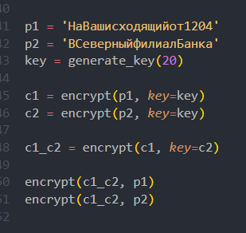
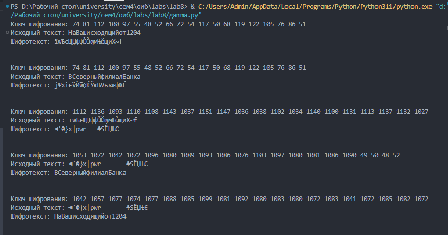

---
## Front matter
lang: ru-RU
title: Лабораторная Работа №8.  Элементы криптографии. Шифрование (кодирование) различных исходных текстов одним ключом
subtitle: Основы информационной безопасности
author:
  - Барсегян В.Л.
institute:
  - Российский университет дружбы народов им. Патриса Лумумбы, Москва, Россия

## i18n babel
babel-lang: russian
babel-otherlangs: english

## Formatting pdf
toc: false
toc-title: Содержание
slide_level: 2
aspectratio: 169
section-titles: true
theme: metropolis
header-includes:
 - \metroset{progressbar=frametitle,sectionpage=progressbar,numbering=fraction}
 - '\makeatletter'
 - '\beamer@ignorenonframefalse'
 - '\makeatother'

## Fonts
mainfont: Arial
romanfont: Arial
sansfont: Arial
monofont: Arial
---


## Докладчик

  * Барсегян Вардан Левонович
  * НПИбд-01-22
  * Российский университет дружбы народов
  * [1132222005@pfur.ru]
  * <https://github.com/VARdamn/oib>
  
# Вводная часть

## Цели и задачи

Освоить на практике применение режима однократного гаммирования на примере кодирования различных исходных текстов одним ключом

# Выполнение лабораторной работы

## Создаю функцию encrypt(), которая будет шифровать заданный текст с помощью однократного гаммирования. На вход функция получает открытый текст, также можно задать определенный ключ шифрования. Если ключа нет, то он генерируется рандомно. Сначала исходный текст и ключ шифрования преобразуются в 16-ную СС, затем, применяется операция XOR для каждого элемента ключа и текста. Полученный шифротекст декодируется из 16-ной СС и получается набор из символов.

## Функция encrypt()

```Python
def encrypt(text: str, key: list = None):
    '''
    Выводит шифротекст для заданного текста.
    Если ключа нет, то генерируется случайный ключ
    '''
    if not key:
        key = generate_key(length=len(text))

    text_16 = [ord(char) for char in text]    
    key = [ord(el) for el in key]

    print(f"Ключ шифрования:", ' '.join(str(s) for s in key))
    print(f"Исходный текст:", text)

    encrypted_text = []
    for i in range(len(text)):
        encrypted_text.append(text_16[i] ^ key[i])

    ciphertext = ''.join([chr(i) for i in encrypted_text])
    print(f'Шифротекст: {ciphertext}\n\n')

    return ciphertext
```

## Генерация ключа, если он не задан, происходит в функции generate_key() из ascii-символов и цифр

```Python
def generate_key(length: int):
    '''
    Генерация рандомного ключа длины length
    '''
    return random.sample(string.ascii_letters + string.digits, length)
```

## Работа программмы: 

- сначала создается случайный ключ и с этим ключом шифруются тексты p1 и p1 (переменные c1 и c2)

- далее, шифротекст с1 шифруется по ключу c2

- полученный шифротекст c1_c2 шифруется по ключу открытого текста. в результате, получаем второй открытый текст, ранее неизвестный

{ #fig:001 width=70% }

## Полный вывод работы программы 

{ #fig:002 width=70% }

## Вывод

Я применил режим однократного гаммирования на примере кодирования различных исходных текстов одним ключом