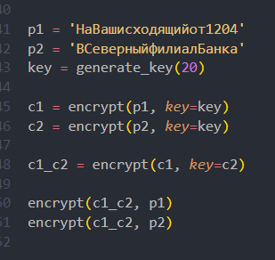
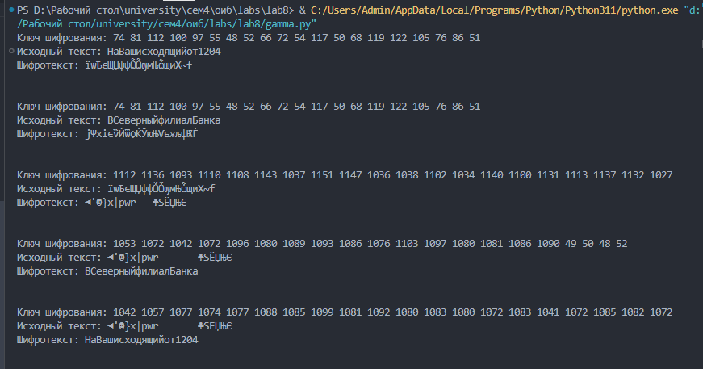

---
## Front matter
title: "Отчёт по лабораторной работе №8"
subtitle: "Дисциплина: Основы информационной безопасности"
author: "Барсегян Вардан Левонович НПИбд-01-22"

## Generic otions
lang: ru-RU
toc-title: "Содержание"

## Bibliography
bibliography: bib/cite.bib
csl: pandoc/csl/gost-r-7-0-5-2008-numeric.csl

## Pdf output format
toc: true # Table of contents
toc-depth: 2
lof: true # List of figures
lot: true # List of tables
fontsize: 12pt
linestretch: 1.5
papersize: a4
documentclass: scrreprt
## I18n polyglossia
polyglossia-lang:
  name: russian
polyglossia-otherlangs:
  name: english
## I18n babel
babel-lang: russian
babel-otherlangs: english
## Fonts
mainfont: Arial
romanfont: Arial
sansfont: Arial
monofont: Arial
mainfontoptions: Ligatures=TeX
romanfontoptions: Ligatures=TeX
sansfontoptions: Ligatures=TeX,Scale=MatchLowercase
monofontoptions: Scale=MatchLowercase,Scale=0.9
## Biblatex
biblatex: true
biblio-style: "gost-numeric"
biblatexoptions:
  - parentracker=true
  - backend=biber
  - hyperref=auto
  - language=auto
  - autolang=other*
  - citestyle=gost-numeric
## Pandoc-crossref LaTeX customization
figureTitle: "Рис."
tableTitle: "Таблица"
listingTitle: "Листинг"
lofTitle: "Список иллюстраций"
lotTitle: "Список таблиц"
lolTitle: "Листинги"
## Misc options
indent: true
header-includes:
  - \usepackage{indentfirst}
  - \usepackage{float} # keep figures where there are in the text
  - \floatplacement{figure}{H} # keep figures where there are in the text
---

# Цель работы

Освоить на практике применение режима однократного гаммирования на примере кодирования различных исходных текстов одним ключом

# Выполнение лабораторной работы

1. Создаю функцию encrypt(), которая будет шифровать заданный текст с помощью однократного гаммирования. На вход функция получает открытый текст, также можно задать определенный ключ шифрования. Если ключа нет, то он генерируется рандомно. Сначала исходный текст и ключ шифрования преобразуются в 16-ную СС, затем, применяется операция XOR для каждого элемента ключа и текста. Полученный шифротекст декодируется из 16-ной СС и получается набор из символов.

```Python
def encrypt(text: str, key: list = None):
    '''
    Выводит шифротекст для заданного текста.
    Если ключа нет, то генерируется случайный ключ
    '''
    if not key:
        key = generate_key(length=len(text))

    text_16 = [ord(char) for char in text]    
    key = [ord(el) for el in key]

    print(f"Ключ шифрования:", ' '.join(str(s) for s in key))
    print(f"Исходный текст:", text)

    encrypted_text = []
    for i in range(len(text)):
        encrypted_text.append(text_16[i] ^ key[i])

    ciphertext = ''.join([chr(i) for i in encrypted_text])
    print(f'Шифротекст: {ciphertext}\n\n')

    return ciphertext
```

2. Генерация ключа, если он не задан, происходит в функции generate_key() из ascii-символов и цифр

```Python
def generate_key(length: int):
    '''
    Генерация рандомного ключа длины length
    '''
    return random.sample(string.ascii_letters + string.digits, length)
```

3. Работа программмы: (рис. [-@fig:001])

- сначала создается случайный ключ и с этим ключом шифруются тексты p1 и p1 (переменные c1 и c2)

- далее, шифротекст с1 шифруется по ключу c2

- полученный шифротекст c1_c2 шифруется по ключу открытого текста. в результате, получаем второй открытый текст, ранее неизвестный

{ #fig:001 width=70% }

4. Полный вывод работы программы (рис. [-@fig:002])

{ #fig:002 width=70% }


# Контрольные вопросы

1. Как, зная один из текстов (P1 или P2), определить другой, не зная при этом ключа?

Нужно применить XOR для двух шифротекстов, а к полученному результату применить XOR с ключом, равным известному открытому тексту. Тогда результатом будет второй открытый текст

2. Что будет при повторном использовании ключа при шифровании текста?

Шифрование будет небезопасным, т.к. с помощью шифротекстов и одного открытого текста можно дешифровать другой текст

3. Как реализуется режим шифрования однократного гаммирования одним ключом двух открытых текстов?

Каждый текст шифруется однократным гаммированием отдельно с использованием этого ключа

4. Перечислите недостатки шифрования одним ключом двух открытых текстов

Главный недостаток - можно дешифровать открытый текст без знания ключа

5. Перечислите преимущества шифрования одним ключом двух открытых текстов.

Т.к. ключей используется меньше, то тратится меньше памяти на хранение и передачу ключей

# Выводы

Я применил режим однократного гаммирования на примере кодирования различных исходных текстов одним ключом

# Список литературы{.unnumbered}

::: {#refs}
:::